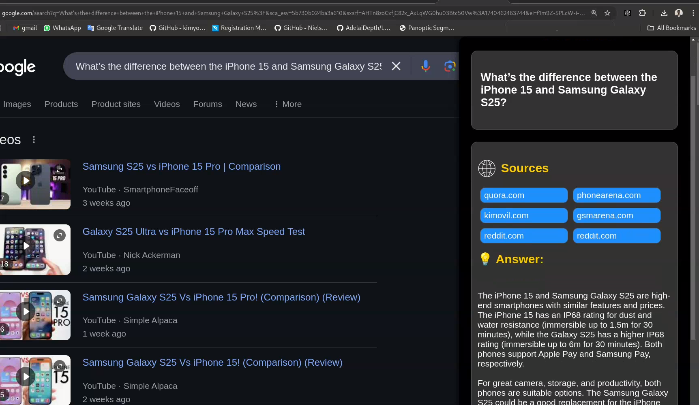

# Web Search Enhancer Chrome Extension 🚀

A Chrome extension that enhances web searches by fetching and summarizing real-time answers from multiple sources using AI. This extension bypasses ads and irrelevant content, giving you concise, accurate results directly in your browser.

---

## Key Features ✨

- **Instant Summaries**: Get a concise, AI-generated summary or direct answer to your web queries.
- **URL Filtering**: Fetches the top 6 relevant URLs, skipping ads and SEO-heavy content.
- **Fast AI Inference**: Summarization done using Groq API for fast, accurate results.
- **Real-Time Updates**: Pulls live data from search results to keep answers up-to-date.

---

## Usage Video 📹

Here is a demo video of the extension in action:

[](https://youtu.be/AFyXFis_U00)

---

## Installation 🛠️

### Prerequisites

- **Google Chrome** or any Chromium-based browser
- **Python 3.x**
- **Pip** (for installing Python packages)

### 1. Clone the repository

```bash
git clone https://github.com/yourusername/your-extension-repo.git
cd your-extension-repo
```

### 2. Install Python dependencies

Make sure you’re using a Python virtual environment. You can create one using `venv` or `conda`.

```bash
python3 -m venv venv
source venv/bin/activate  # On Windows, use `venv\Scriptsctivate`
pip install -r requirements.txt
```

---

## Chrome Extension Setup 🔧

### 1. Load the Extension in Chrome

- Open **Chrome** and go to `chrome://extensions/`.
- Enable **Developer Mode** (toggle in the top right).
- Click on **Load unpacked**.
- Select the project directory where you cloned this repository.

### 2. Run the Python Server

In the same terminal where you installed the Python dependencies:

```bash
python server/server.py
```

### 3. Pin the Extension

After the extension is loaded, you should see the extension icon in your browser’s toolbar.
Pin the extension by clicking the **puzzle piece** icon in the toolbar and selecting the extension.

### 4. Set Up the Grok API

- Go to the [Grok website](https://www.grok.com/) and create an account.
- Generate an API key under the **API** section.
- Use the open-source model: `mixtral-8x7b-32768`.
- Open `server.py` and replace the API key placeholder with your actual key:

```python
GROQ_API_KEY = "your_api_key_here"  # Replace with your Grok API key
client = Groq(api_key=GROQ_API_KEY)
```
### 5. Use the Extension

- Click on the extension icon in the toolbar to open the popup.
- Type your search query and get a real-time AI-generated summary directly in your browser.

---

## Contributions 🤝

Feel free to open issues or submit pull requests if you want to contribute. This is an open-source project, and we welcome feedback!
